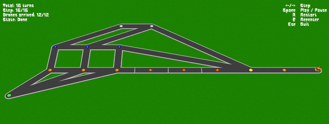

<p align="center"><i>This project has been created as part of the 42 curriculum by gviola-l.</i></p>


## Table of Contents
- [Description](#description)
- [Instructions](#instructions)
- [Algorithm](#algorithm)
- [Visualization](#visualization)
- [Resources](#resources)

---

<a name="description"></a>
## `🔍` | Description

**Fly-In** is a multi-drone pathfinding simulation written in Python. A fleet of drones has to get from one start zone to one end zone across a graph of connected zones, in as few turns as possible.

Each zone has a type (`normal`, `priority`, `restricted` or `blocked`) and a capacity that limits how many drones can sit in it at once. The connections between zones have a capacity too. Drones move one step per turn, in parallel when the capacities allow it. When a path is full they wait at the bottleneck or take a slower restricted detour, and the scheduler keeps them from deadlocking. The simulation is rendered in 3D where each drone is a car driving across the network in real time.

---

<a name="instructions"></a>
## `📝` | Instructions

You need Git, Python 3.10 and uv. The Makefile handles the rest:

```shell
git clone https://github.com/Gqtien/Fly-in.git
cd Fly-in
make
```

A dialog box opens to pick the map.

---

<a name="algorithm"></a>
## `🧩` | Algorithm

### Graph

The map is loaded into a graph (`dict[str, list[tuple[str, float]]]`). Each edge carries the weight of its destination zone:

| Zone type    | Edge weight | Movement cost |
|--------------|-------------|---------------|
| `normal`     | 1.0         | 1 turn        |
| `priority`   | 0.5         | 1 turn        |
| `restricted` | 2.0         | 2 turns       |
| `blocked`    | ∞           | inaccessible  |

Blocked zones are left out of the graph, so they can't be reached. The lower weight on priority zones makes Dijkstra prefer them.

### Pathfinding

A custom Dijkstra computes the shortest path from a source hub to every other reachable hub. It returns both a distance map and a predecessor map, so any path can be rebuilt later without rerunning the search.

### Per-turn scheduling

Every turn, the `Scheduler` runs one Dijkstra per idle drone position and picks the cheapest path to the end hub for each drone.

### Simulation engine

`Simulator.step()` advances every drone once per turn. Drones are processed in deterministic order so that zones freed by outgoing drones can be filled within the same turn.

---

<a name="visualization"></a>
## `🎥` | Visualization

<p align="center"></p>

The 3D view runs on `Ursina`, a `panda3d` wrapper. Hubs are drawn as round intersections connected by asphalt roads, and drones are cars driving from one to the next.

The HUD shows the current step, total turns, drones arrived, and playback state. You can play the run continuously or step through it by hand.

| Key     | Action                  |
|---------|-------------------------|
| `Space` | Play / pause            |
| `← / →` | Step backward / forward |
| `R`     | Restart                 |
| `C`     | Recenter camera         |
| `Esc`   | Quit                    |


---

<a name="resources"></a>
## `📚` | Resources

### Docs

- [Dijkstra's algorithm](https://en.wikipedia.org/wiki/Dijkstra%27s_algorithm)
- [Ursina sources](https://github.com/pokepetter/ursina)

### AI usage

AI was used for:
- generating edge-case maps in bulk to stress-test the parser
- helping with mesh geometry in `src/visualization/mesh`
- exploring Ursina's APIs when the official documentation was thin
- auditing the codebase against the subject to catch spec deviations
